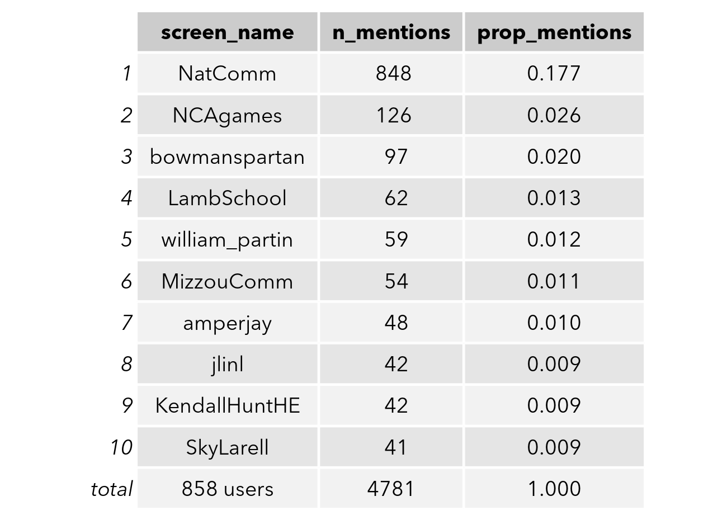
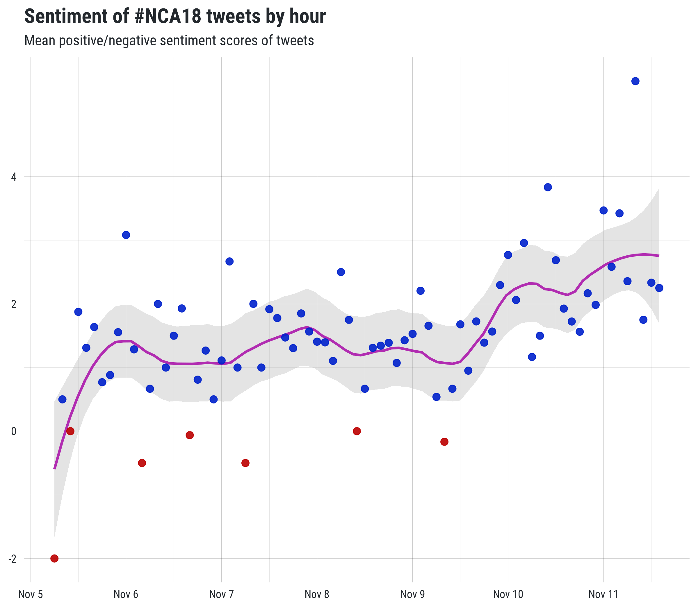

# #NCA18 tweets
Collecting data on Twitter statuses containing the #nca18 hashtag.

## Importing the data
To download the Twitter data, use the following code:

``` r
## install rtweet if not already
if (requireNamespace(!"rtweet", quietly = TRUE)) {
  install.packages("rtweet")
}
## read status IDs
sids <- rtweet::read_twitter_csv("status_id.csv")

## lookup full tweets dat
d <- rtweet::lookup_tweets(sids$status_id)
```

### Status frequency
Frequency of NCA tweets.


### Top tweeters
Accounts that have posted the most statuses.


### Top mentions
Accounts most frequently mentioned.



### Sentiment analysis
Sentiment (positive/negative) of statuses over time.



### Network analysis
Semantic (quotes, retweets, and mentions) network connections.


### Word cloud
Most popular words appearing in statuses (stop words excluded).


