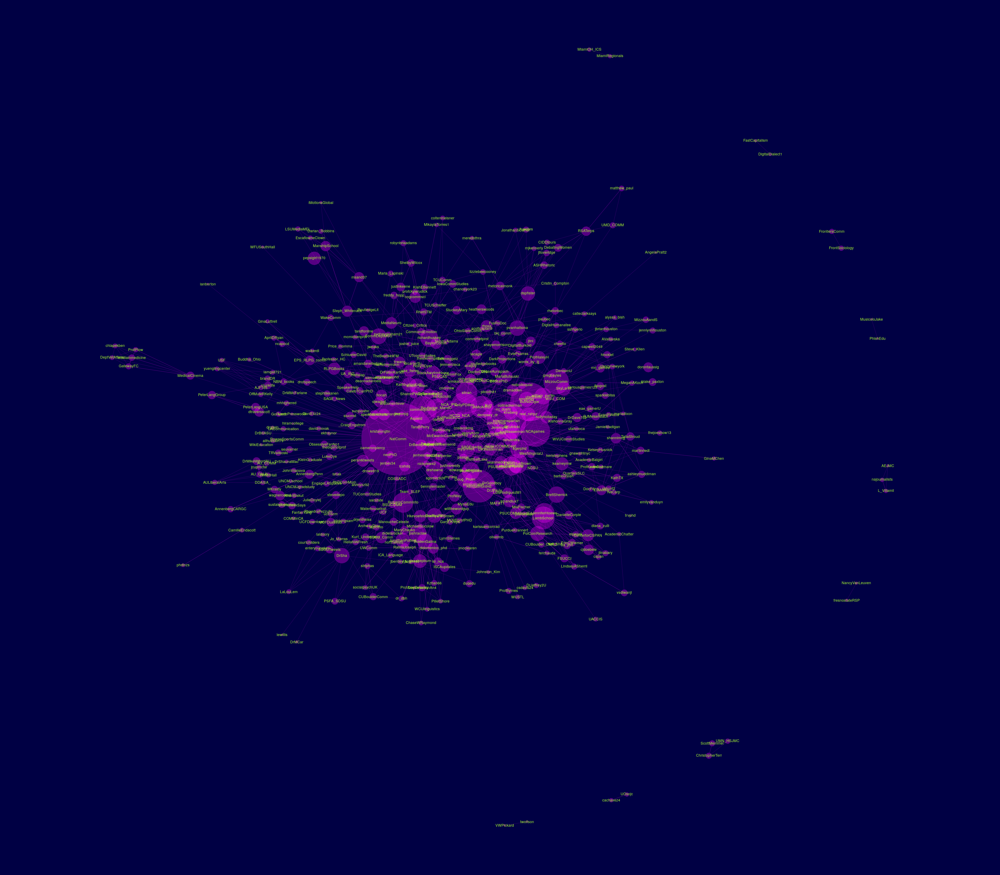

# #NCA18 tweets
Collecting data on Twitter statuses containing the #nca18 hashtag.

## Importing the data
To download the Twitter data, use the following code:

``` r
## install rtweet if not already
if (!requireNamespace("rtweet", quietly = TRUE)) {
  install.packages("rtweet")
}

## read status IDs
sids <- rtweet::read_twitter_csv(
  "https://raw.githubusercontent.com/mkearney/NCA18/master/status_id.csv"
)

## lookup full tweets dat
d <- rtweet::lookup_tweets(sids$status_id)
```

<p style="align=center">  </p>

<p style="align=center">  </p>

<p style="align=center">  </p>

<p style="align=center">  </p>

<p style="align=center">  </p>

<p style="align=center">  </p>
