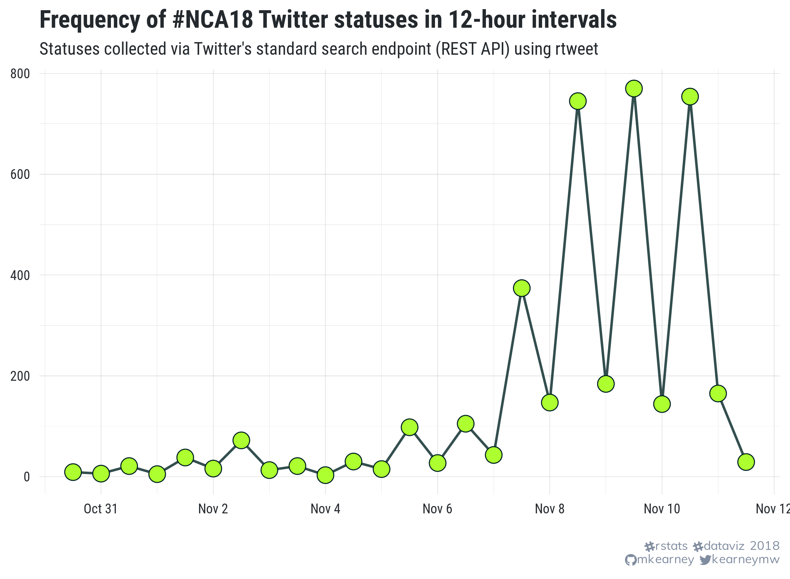
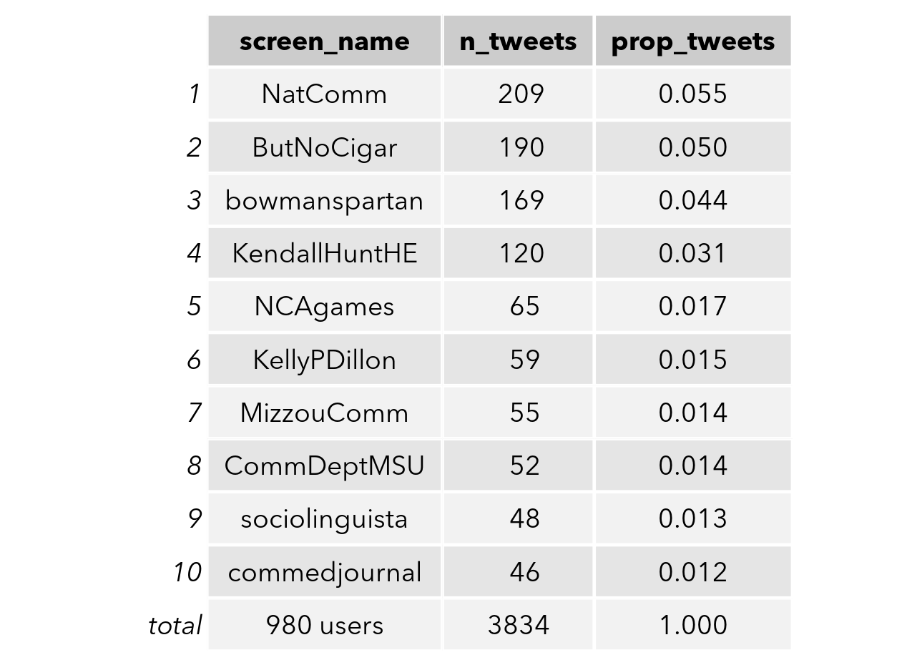
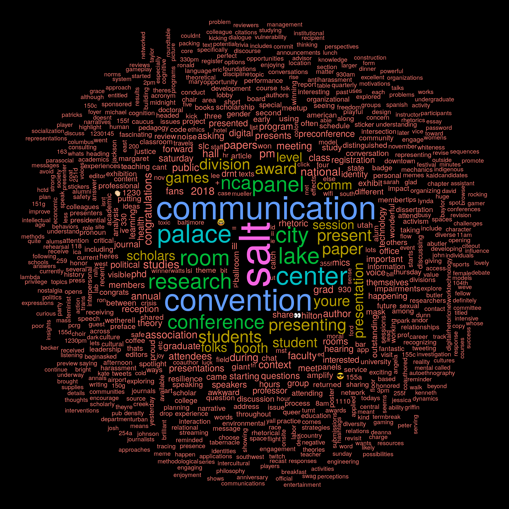

# #NCA18 tweets
Collecting data on Twitter statuses containing the #nca18 hashtag.

## Importing the data
To import the Twitter data, see the [R/data.R](R/data.R) script file.

### Status frequency
The number of #nca18 tweets aggregated in 1-hour intervals. View the
code [here](R/time_series.R).

### Top tweeters
Accounts that have posted the most statuses. View the code
[here](R/freq_tables.R).

### Top mentions
Accounts most frequently mentioned. View the code
[here](R/freq_tables.R).

### Sentiment analysis
Sentiment (positive/negative) of statuses over time. View the code
[here](R/sentiment_analysis.R).

### Network analysis
Semantic (quotes, retweets, and mentions) network connections. View
the code [here](R/network_analysis.R).

### Word cloud
Most popular words appearing in statuses (stop words excluded). View
the code [here](R/word_cloud.R).

